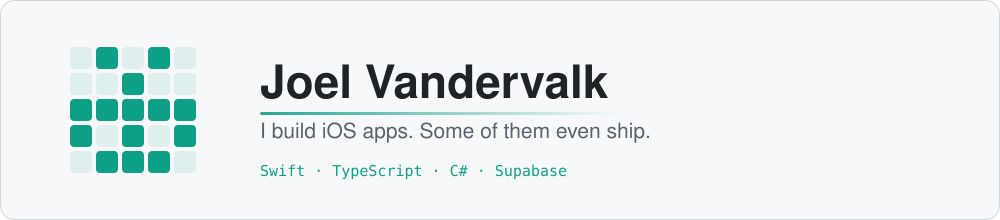

  <a href="#"><picture>
    <source media="(prefers-color-scheme: dark)" srcset="profile/banner-dark.svg">
    
  </picture></a>

<!-- Every image sits in <a href="#"> on purpose: without an explicit link GitHub wraps each one in a link to the raw image file. -->
<!-- Banner is static: edit and rerun scripts/make-banner.py. Every card below shares its teal accent (3DDBB8 dark, 0E9F87 light). -->

  
  
  
  
  
  
  
  
  

  <a href="#"><picture>
    <source media="(prefers-color-scheme: dark)" srcset="profile/streak-dark.svg">
    
  </picture></a>
  <a href="#"><picture>
    <source media="(prefers-color-scheme: dark)" srcset="https://readme-stats-sand-zeta.vercel.app/api/top-langs?username=vandervalkjoel&layout=compact&langs_count=8&exclude_repo=hyperos-ios&hide_border=true&cache_seconds=21600&custom_title=Languages&bg_color=0D1117&title_color=3DDBB8&text_color=C9D1D9">
    
  </picture></a>

  <a href="#"><picture>
    <source media="(prefers-color-scheme: dark)" srcset="https://readme-activity-graph-three.vercel.app/graph?username=vandervalkjoel&hide_border=true&months=6&area=true&smooth=7&hide_points=true&x_axis=month&daily=true&custom_title=Last%206%20months&bg_color=0D1117&color=C9D1D9&title_color=3DDBB8&line=3DDBB8&point=3DDBB8&area_color=3DDBB8&daily_color=1F6F5F">
    <!-- months= accepts 1 to 12. Change it in both URLs, above and below. -->
    <!-- daily_color is a quieter shade of the accent so the bars sit behind the line. -->
    
  </picture></a>

